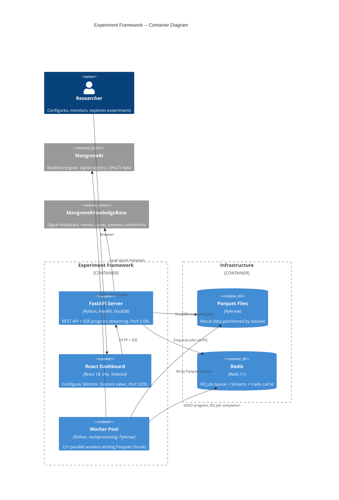
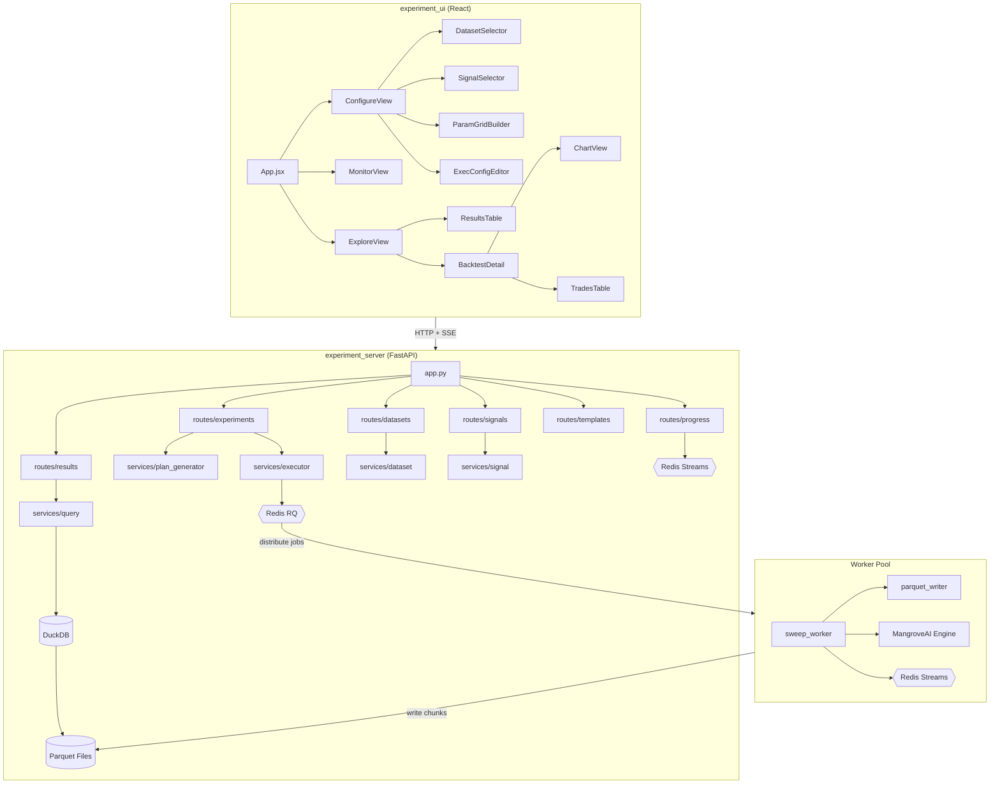
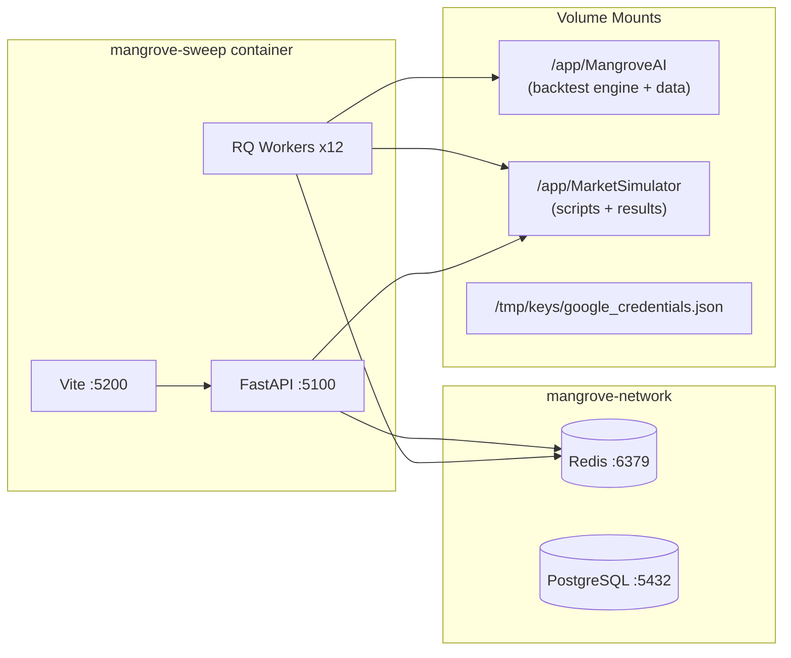
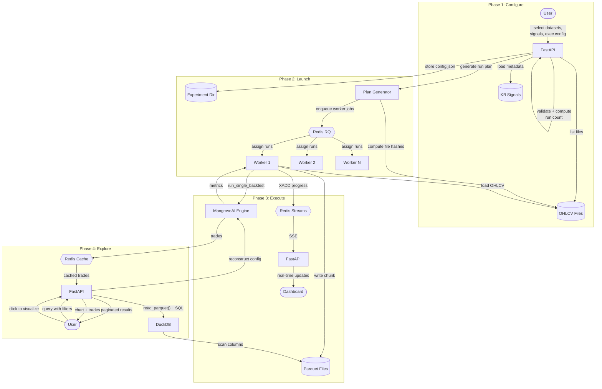
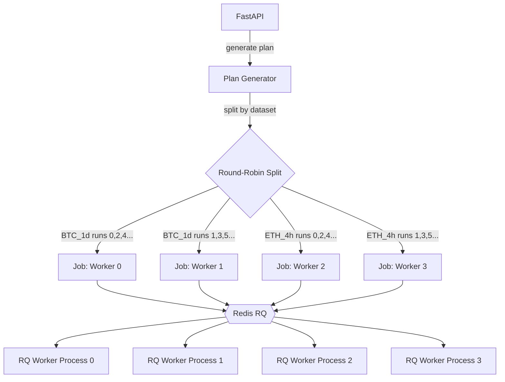
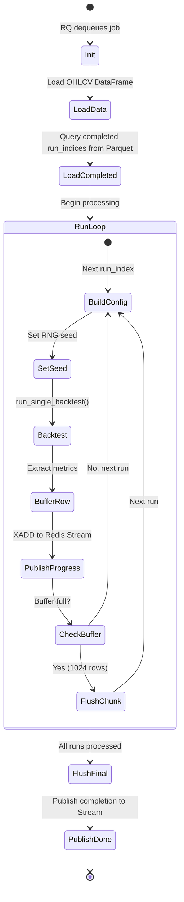

# Experiment Framework -- System Architecture Document

Date: 2026-02-28
Status: Draft
Author: Tim Darrah + Claude
Depends on:
- [Requirements Document](./2026-02-28-experiment-framework-requirements.md)
- [Specification Document](./2026-02-28-experiment-framework-specification.md)

## 1. System Overview

The Experiment Framework is a standalone application within MarketSimulator
that orchestrates backtest experiments at scale. It is composed of four
runtime processes: a FastAPI server, a React dashboard, Redis, and one or
more worker processes.



## 2. Component Architecture

### 2.1 Directory Structure

```
MarketSimulator/
  experiment_server/                 Python package (FastAPI backend)
    __init__.py
    app.py                           FastAPI application factory
    config.py                        Settings (ports, paths, Redis URL)
    models/
      __init__.py
      experiment.py                  Pydantic models: ExperimentConfig, etc.
      results.py                     Pydantic models: ResultRow, ProgressEvent
    services/
      __init__.py
      plan_generator.py              Deterministic run plan from config
      executor.py                    Worker management, RQ job creation
      query.py                       DuckDB queries over Parquet
      dataset.py                     Data file discovery + hashing
      signal.py                      KB signal metadata loading
    routes/
      __init__.py
      experiments.py                 CRUD + lifecycle endpoints
      results.py                     Query + visualization endpoints
      datasets.py                    Data file listing
      signals.py                     Signal metadata
      templates.py                   Template CRUD
      progress.py                    SSE streaming endpoint
    workers/
      __init__.py
      sweep_worker.py                RQ worker function
      parquet_writer.py              PyArrow schema + chunk writer
  experiment_ui/                     React frontend
    package.json
    vite.config.js
    tailwind.config.js
    src/
      App.jsx                        Router + layout
      api/
        client.js                    Axios wrapper for FastAPI
      views/
        ConfigureView.jsx            Experiment configuration
        MonitorView.jsx              Progress monitoring
        ExploreView.jsx              Results exploration
      components/
        datasets/
          DatasetSelector.jsx        Multi-select table widget
        signals/
          SignalSelector.jsx         Two-panel signal picker
          ParamGridBuilder.jsx       Per-param sweep config
        execution/
          ExecConfigEditor.jsx       Table with sweep toggles
        results/
          ResultsTable.jsx           Paginated, sortable table
          BacktestDetail.jsx         Metrics + chart + trades
          ChartView.jsx              OHLCV + trade markers
          TradesTable.jsx            Individual trade list
        common/
          CollapsibleSection.jsx     Expand/collapse wrapper
          ProgressBar.jsx            Progress visualization
          StatusBadge.jsx            Experiment status indicator
  data/
    experiments/                     Experiment results (Parquet)
    templates/                       Saved experiment templates (JSON)
```

### 2.2 Component Dependency Graph



## 3. Runtime Architecture

### 3.1 Process Model

Four processes run inside the Docker container:

| Process | Technology | Port | Role |
|---------|-----------|------|------|
| FastAPI server | uvicorn | 5100 | API + SSE |
| React dev server | Vite | 5200 | Dashboard UI |
| Redis | redis-server | 6379 | Queue + streams + cache |
| RQ workers | rq worker | -- | Backtest execution |

In production, the React app is built to static files and served by FastAPI
(no separate Vite process). Redis may run as a separate container on
mangrove-network or locally within the sweep container.

### 3.2 Container Setup



Docker run command:
```bash
docker run -d --name mangrove-sweep \
    --network mangrove-network \
    -v /path/to/MangroveAI/src/MangroveAI:/app/MangroveAI \
    -v /path/to/MarketSimulator:/app/MarketSimulator \
    -v ~/.config/gcloud/application_default_credentials.json:/tmp/keys/google_credentials.json:ro \
    -p 5100:5100 \
    -p 5200:5200 \
    -e OMP_NUM_THREADS=1 \
    -e OPENBLAS_NUM_THREADS=1 \
    -e MKL_NUM_THREADS=1 \
    -e ENVIRONMENT=local \
    -e REDIS_URL=redis://redis:6379 \
    mangroveai-mangrove-app sleep infinity
```

Note: MangroveAI's PostgreSQL is on mangrove-network but is NOT used by the
experiment framework for result storage. It is only used by the backtest
engine internally (e.g., loading signal metadata if `--signals kb` mode
queries the DB).

### 3.3 Data Flow by Phase



## 4. Storage Architecture

### 4.1 Parquet File Organization

```
data/experiments/
  {experiment_id}/
    config.json                          Experiment config (provenance record)
    results/
      {asset}_{timeframe}/               Partition directory per dataset
        worker_{nn}_chunk_{nnn}.parquet   1024-row chunks per worker
```

Each Parquet file:
- Uses Snappy compression (default, fast, reasonable ratio)
- Contains experiment config in Parquet key-value metadata
- Has a consistent schema (67 columns, defined in parquet_writer.py)
- Is immutable once written (append-only, no updates)

### 4.2 DuckDB Query Layer

DuckDB is used as an in-process query engine. No DuckDB database file is
created -- all queries read Parquet files directly.

```python
import duckdb

def query_results(experiment_id: str, filters: dict, sort: str,
                  order: str, limit: int, offset: int) -> list[dict]:
    """Execute a filtered, sorted, paginated query over Parquet results."""
    conn = duckdb.connect()  # in-memory, no file
    path = f"data/experiments/{experiment_id}/results/**/*.parquet"

    where_parts = []
    params = []
    for key, value in filters.items():
        where_parts.append(f"{key} = ?")
        params.append(value)

    where_sql = " AND ".join(where_parts) if where_parts else "1=1"

    sql = f"""
        SELECT * FROM read_parquet('{path}')
        WHERE {where_sql}
        ORDER BY {sort} {order} NULLS LAST
        LIMIT ? OFFSET ?
    """
    params.extend([limit, offset])

    result = conn.execute(sql, params).fetchdf()
    conn.close()
    return result.to_dict("records")
```

Key DuckDB behaviors:
- **Predicate pushdown**: Filters on native columns (asset, trigger_name,
  reward_factor) are pushed into the Parquet reader. Only matching row
  groups are loaded.
- **Column pruning**: Only columns referenced in SELECT/WHERE/ORDER BY are
  read from disk. A query for `sharpe_ratio` and `asset` skips all other
  columns.
- **Partition pruning**: Querying a specific dataset path
  (`results/BTC_1d/*.parquet`) avoids scanning other datasets entirely.

### 4.3 Redis Data Structures

| Key Pattern | Type | Purpose | TTL |
|-------------|------|---------|-----|
| `rq:queue:experiments` | List | RQ job queue | -- |
| `exp:{id}:progress` | Stream | Worker progress updates | Trimmed on completion |
| `exp:{id}:trades:{run_index}` | String (JSON) | Cached trade data for visualization | 1 hour |
| `exp:{id}:status` | String | Current experiment status | -- |

### 4.4 Experiment Config Storage

The experiment config is stored in two places (not redundancy -- different
access patterns):

1. **`config.json`** in the experiment directory -- loaded by the dashboard
   when listing experiments, by workers at startup, and by the API for
   provenance queries. Fast to read, human-readable.

2. **Parquet file metadata** -- embedded in every chunk file as a key-value
   pair. Ensures that the config travels with the data even if config.json
   is separated (e.g., when syncing individual Parquet files to GCS).

## 5. Worker Architecture

### 5.1 Job Distribution



Each job contains:
- `experiment_id`
- `dataset_key` (e.g., "BTC_1d")
- `worker_id` (globally unique across the experiment)
- `run_indices` (list of run_index values this worker is responsible for)

Workers are started as RQ worker processes (not multiprocessing.Pool).
This allows the dashboard to manage them independently and supports
adding/removing workers dynamically.

### 5.2 Worker Lifecycle



### 5.3 RNG Seeding for Reproducibility

The backtest engine uses `random.uniform()` for slippage simulation.
To ensure reproducibility:

```python
import random

for run in worker_plan:
    # Deterministic per-run seed derived from experiment seed + run_index
    run_seed = experiment_seed * 1000000 + run.run_index
    random.seed(run_seed)

    result = run_single_backtest(...)
```

This ensures:
- Same run_index always gets the same slippage values
- Different run_indices get different slippage (no correlation)
- Resume produces identical results for the same run_index

## 6. API Architecture

### 6.1 FastAPI Application Structure

```python
# experiment_server/app.py
from fastapi import FastAPI
from fastapi.middleware.cors import CORSMiddleware

def create_app() -> FastAPI:
    app = FastAPI(
        title="MarketSimulator Experiment Framework",
        version="1.0.0",
    )

    app.add_middleware(
        CORSMiddleware,
        allow_origins=["http://localhost:5200"],
        allow_methods=["*"],
        allow_headers=["*"],
    )

    from .routes import experiments, results, progress, datasets, signals, templates
    app.include_router(experiments.router, prefix="/api/v1")
    app.include_router(results.router, prefix="/api/v1")
    app.include_router(progress.router, prefix="/api/v1")
    app.include_router(datasets.router, prefix="/api/v1")
    app.include_router(signals.router, prefix="/api/v1")
    app.include_router(templates.router, prefix="/api/v1")

    return app
```

### 6.2 Service Layer

Services are pure functions or stateless classes. No singletons, no global
state. Dependencies (Redis connection, DuckDB, file paths) are injected
via FastAPI's dependency injection.

```python
# Dependency injection example
from functools import lru_cache
import redis
import duckdb

@lru_cache
def get_redis() -> redis.Redis:
    return redis.from_url(settings.redis_url)

def get_duckdb() -> duckdb.DuckDBPyConnection:
    return duckdb.connect()  # in-memory, per-request

# Used in routes:
@router.get("/experiments/{id}/results")
async def query_results(
    id: str,
    r: redis.Redis = Depends(get_redis),
    db: duckdb.DuckDBPyConnection = Depends(get_duckdb),
):
    ...
```

### 6.3 Error Handling

All API errors return structured JSON:
```json
{
  "error": "validation_failed",
  "message": "Signal 'nonexistent_signal' not found in knowledge base",
  "details": {"signal_name": "nonexistent_signal"}
}
```

HTTP status codes:
- 400: Validation errors, bad parameters
- 404: Experiment/template not found
- 409: Conflict (e.g., launching an already-running experiment)
- 500: Internal errors (logged with traceback)

## 7. Frontend Architecture

### 7.1 Route Structure

```
/                           Redirect to /configure
/configure                  ConfigureView
/configure/:template        ConfigureView pre-filled from template
/monitor                    MonitorView (list of experiments)
/monitor/:experiment_id     MonitorView (specific experiment progress)
/explore                    ExploreView (experiment selector)
/explore/:experiment_id     ExploreView (results for specific experiment)
```

### 7.2 State Management

No global state library (Redux, Zustand). Each view manages its own state
via React hooks. Data fetching uses a simple pattern:

```jsx
// Shared hook for API calls
function useApi(url, deps = []) {
    const [data, setData] = useState(null);
    const [loading, setLoading] = useState(true);
    const [error, setError] = useState(null);

    useEffect(() => {
        client.get(url)
            .then(res => setData(res.data))
            .catch(err => setError(err))
            .finally(() => setLoading(false));
    }, deps);

    return { data, loading, error };
}
```

SSE connections are managed per-component with cleanup on unmount.

### 7.3 Component Design Principles

- **CollapsibleSection**: Reusable wrapper with expand/collapse toggle,
  chevron icon, `bg-gray-50` header, `bg-white` body. Used by every
  section in ConfigureView.

- **ParamGridBuilder**: Adapts to data type. Renders different controls
  for int (number input with step=1), float (number input with step=0.01),
  bool (checkbox group), str (dropdown). Shows range hint from KB metadata.
  Two input modes: explicit values (comma-separated) or range (min/max/step).

- **DatasetSelector**: Table component with checkbox column, search input,
  sortable column headers. Selected items shown as count badge.

- **ResultsTable**: Server-side pagination (not client-side). Column headers
  are clickable for sorting. Filter bar above the table with dropdowns and
  number inputs.

## 8. Technology Decisions

| Decision | Alternatives Considered | Rationale |
|----------|------------------------|-----------|
| DuckDB + Parquet | PostgreSQL, SQLite | Analytical queries 100-1000x faster. No DB server. GCS-portable. Columnar compression. |
| Redis RQ | Celery, multiprocessing.Pool | Lightweight, simple, sufficient for single-user. Celery is overkill. multiprocessing.Pool doesn't support pause/resume/monitoring. |
| Redis Streams | Polling, WebSocket | Durable (catch-up on reconnect), built into Redis, natural fit with SSE. WebSocket adds complexity for a single-user tool. |
| FastAPI | Flask | Async support, auto OpenAPI docs, Pydantic validation, SSE streaming. |
| React + Vite | Next.js, Svelte | Matches MangroveAI admin codebase. No SSR needed. Vite for fast dev. |
| Tailwind CSS | Material UI, CSS Modules | Matches MangroveAI admin patterns. Utility-first, no component lock-in. |
| PyArrow for Parquet | pandas to_parquet, polars | Direct schema control, streaming writes, metadata injection. |
| No ORM | SQLAlchemy, Tortoise | No relational DB to map. DuckDB queries are raw SQL. Simpler. |

## 9. Scalability Considerations

### 9.1 Current Scale

| Dimension | Expected Range |
|-----------|---------------|
| Experiments | 10-100 over project lifetime |
| Runs per experiment | 50K - 1M (grid) or user-defined (random) |
| Total result rows | 1-10M across all experiments |
| Workers | 2-12 per experiment |
| Concurrent dashboard users | 1 |
| Parquet files per experiment | 20-200 (workers x chunks) |
| Storage per experiment | 50MB - 1GB |

### 9.2 Bottlenecks and Mitigations

| Bottleneck | Mitigation |
|-----------|-----------|
| DuckDB query time on 10M+ rows | Partition by dataset. Most queries target one experiment + one dataset. Predicate and column pruning handle the rest. |
| Too many small Parquet files | Increase chunk size from 1024 to 4096-8192. Post-experiment compaction step (merge small files into larger ones). |
| Redis memory for progress streams | XTRIM streams after experiment completes. Streams are small (one entry per progress update, not per run). |
| Worker startup time (loading OHLCV data) | Each worker loads data once. For 5m data with 100K+ rows, this takes ~1 second. Negligible vs backtest time. |
| File system limits (many small files) | The partition-by-dataset layout keeps files organized. A 6-dataset, 12-worker experiment produces ~120 files max. |

### 9.3 Future Scaling Path

If the framework grows beyond single-machine use:
1. **GCS integration**: Parquet files synced to cloud. DuckDB can read
   directly from `gs://` URIs.
2. **DuckDB MotherDuck**: Cloud-hosted DuckDB for shared query access
   without running a local instance.
3. **Redis cluster**: If job volume exceeds single Redis capacity
   (unlikely for this use case).
4. **Worker distribution**: RQ workers can run on multiple machines
   connected to the same Redis instance.

## 10. Security Considerations

This is a single-user local research tool. Security is minimal:
- No authentication on the API (runs on localhost only)
- CORS restricted to `localhost:5200`
- No sensitive data in result files (strategy configs, not credentials)
- Redis has no password (local-only)

When the API is exposed externally (future phase):
- Add API key authentication
- Restrict CORS to specific origins
- Add rate limiting
- Redis password required
- Audit logging on experiment operations

## 11. Deployment

### 11.1 Development

```bash
# Terminal 1: Start Redis
docker run -d --name experiment-redis --network mangrove-network -p 6379:6379 redis:7

# Terminal 2: Start FastAPI
cd MarketSimulator && uvicorn experiment_server.app:create_app --host 0.0.0.0 --port 5100 --reload

# Terminal 3: Start React dev server
cd MarketSimulator/experiment_ui && npm run dev

# Terminal 4: Start RQ workers
cd MarketSimulator && rq worker experiments --url redis://localhost:6379
```

### 11.2 Docker (Production)

All four processes run inside the mangrove-sweep container. A process
manager (supervisord or a shell script) starts them together.

```dockerfile
# Added to the mangrove-sweep container setup
RUN pip install fastapi uvicorn duckdb pyarrow redis rq
RUN npm install --prefix /app/MarketSimulator/experiment_ui

EXPOSE 5100 5200

CMD ["supervisord", "-c", "/app/MarketSimulator/supervisord.conf"]
```

### 11.3 Dependencies

**Python (backend + workers)**:
- fastapi
- uvicorn
- duckdb
- pyarrow
- redis
- rq
- pydantic

**Node.js (frontend)**:
- react, react-dom, react-router-dom
- vite
- tailwindcss, postcss, autoprefixer
- axios
- lightweight-charts (for OHLCV visualization)
- @heroicons/react

**Infrastructure**:
- Redis 7+
- Docker (existing mangrove-sweep container)
- MangroveAI (mounted volume, runtime import)
