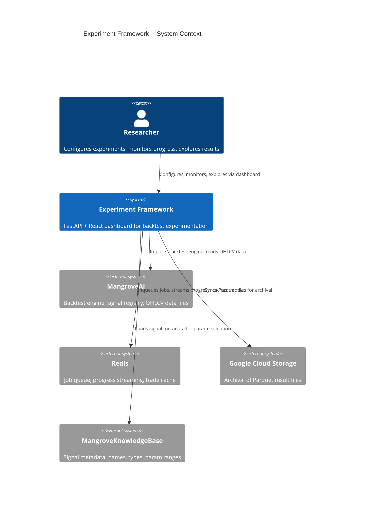
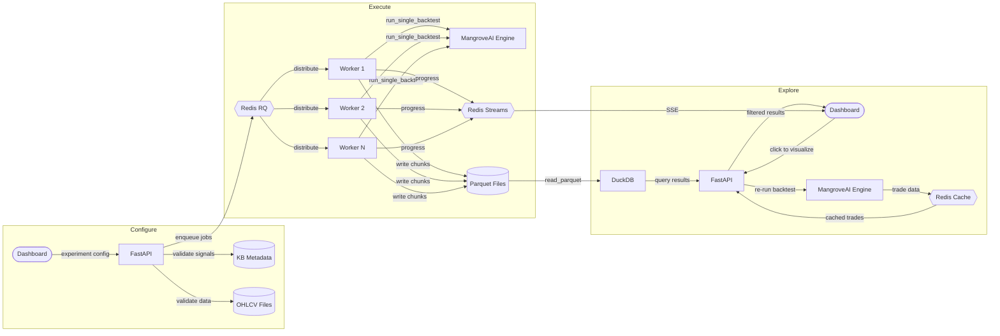
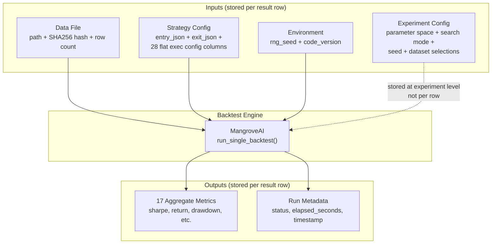

# Experiment Framework -- Requirements Document

Date: 2026-02-28
Status: Draft
Author: Tim Darrah + Claude

## 1. Problem Statement

The v1 backtest permutation sweep explored only the signal parameter space
(which trigger, which filter, what signal param values) while holding the
execution config fixed (reward_factor=2.0, cooldown_bars=2, etc.). This means
100K+ results only answer "which signals work?" but not "which signals work
under which execution settings?"

We need an experimentation framework that:
- Sweeps entry signals, exit signals, AND execution config params
- Scales to millions of experiment runs
- Tracks full data provenance so any result can be reproduced
- Provides a dashboard to configure, launch, monitor, and analyze experiments

## 2. Goals

1. **Reproducibility**: Given any result row, reconstruct the exact inputs
   (strategy config + data file hash + seed + code version) and re-run to get
   the same output.

2. **Efficiency at scale**: Store and query millions of result rows without
   degrading performance. Minimize storage footprint.

3. **Flexible parameter sweeping**: Configure which parameters to sweep, their
   ranges/values, and how they combine (grid search or random search).
   Support numeric (int/float), boolean, and string param types with
   validation from the knowledge base.

4. **Interactive dashboard**: A web UI to define experiments, monitor progress
   in real time, explore results with filters and sorting, and visualize
   individual backtest runs on demand.

5. **Extensibility**: The framework accommodates entry signal sweeping, exit
   signal sweeping, multi-filter entry, and execution config sweeping from
   day one. Future experiment types (cross-validation, walk-forward) should
   not require architectural changes.

6. **Cloud-ready**: Result files (Parquet) are portable to GCS buckets for
   archival and cross-machine access.

## 3. Non-Goals (for v1 of the framework)

- Multi-user access or authentication
- Automated experiment scheduling (cron-based reruns)
- Real-time trading integration
- Downloading new data from MangroveAI API (future phase -- see section 12)

## 4. Users

Single user (researcher/developer) operating the framework locally via a web
dashboard and CLI. The framework runs inside a Docker container on the local
machine.

## 5. Functional Requirements

### FR-1: Experiment Configuration (Configure View)

The Configure view is a single scrollable page with collapsible/expandable
sections. All sections visible at once, expand what you need.

#### FR-1.1: Data Selection

A multi-select, searchable, filterable, sortable dropdown widget showing
available data files as rows with columns:

| Asset | Timeframe | Start Date | End Date | Rows |
|-------|-----------|------------|----------|------|
| BTC   | 1d        | 2022-08-01 | 2026-02-15 | 1298 |
| ETH   | 4h        | 2024-01-01 | 2026-02-01 | 4392 |
| DOGE  | 5m        | 2021-04-01 | 2021-06-15 | 21600 |

The user selects one or more rows. The widget supports search (type "BTC"
to filter), column sorting (click "Timeframe" header), and multi-select
(checkboxes).

**Future phase**: Instead of selecting from existing files, the user can
choose any approved asset from the MangroveAI API, pick a timeframe and
date range, and download the data. Downloaded files are added to the data
directory and become available for future experiments.

#### FR-1.2: Entry Signals

Each signal is presented as:
- **Signal type**: TRIGGER or FILTER (from KB metadata)
- **Signal name**: e.g., `ema_cross_up`, `rsi_oversold` (from KB)
- **Parameters**: Each param shows its name, type (int/float/str/bool),
  default value, and valid range (min/max from KB). The user configures
  sweep values per param using the param grid builder (FR-1.4).

Signal list is loaded from the MangroveKnowledgeBase. Searchable and
filterable by type (TRIGGER/FILTER) and name.

The user selects which signals to include in the sweep. Entry requires at
least 1 TRIGGER + at least 1 FILTER.

Min/max filters per entry: configurable (default 1 trigger + 1 filter,
expandable to multi-filter in future).

#### FR-1.3: Exit Signals

Same structure as entry signals. The user selects exit signals and
configures their parameter sweeps. Exit signals are first-class from day
one -- not a "future" feature.

Exit list can be empty (engine defaults to SL/TP from execution config).

#### FR-1.4: Param Grid Builder

For every sweepable parameter (signal params AND execution config params),
the grid builder adapts to the data type:

- **int**: min, max, step inputs OR explicit comma-separated values.
  Validated against KB bounds.
- **float**: min, max, step inputs OR explicit comma-separated values.
  Validated against KB bounds.
- **bool**: checkboxes for true, false, or both.
- **str**: multi-select dropdown from known valid values.

**Constraint enforcement**: Constraints like `window_fast < window_slow` are
enforced at run generation time, not at range definition time. The user can
set window_fast range [1, 50] and window_slow range [25, 100] -- the
overlapping region [25, 50] is valid, but any generated combination where
fast >= slow is filtered out. Constraints are defined in signal metadata.

#### FR-1.5: Execution Config

All 28+ execution config fields displayed with their current defaults from
`trading_defaults.json`. Each field has a toggle to include it in the sweep.
When toggled on, the param grid builder (FR-1.4) appears for that field.

Fields not toggled for sweep use their default value for all runs.

#### FR-1.6: Search Mode and Budget

Two search modes:

- **Grid search**: Every valid combination of all swept parameters is
  generated. The total run count is auto-calculated and displayed.
  No manual budget input needed.

- **Random search**: The user specifies N (number of runs per dataset).
  Combinations are sampled randomly from the parameter space using the
  seed for reproducibility.

Additional options:
- Workers per symbol (default 2)
- Seed (default 42)

#### FR-1.7: Provenance

- Code version: auto-detected from git SHA (editable override)
- Experiment name and description (free text)
- Notes (free text)

#### FR-1.8: Validation

Before launch, the framework validates:
- At least one dataset selected
- At least one entry trigger and one entry filter selected
- All param ranges are within KB-defined bounds
- Constraints are satisfiable (at least some valid combinations exist)
- For grid search: total run count computed and displayed
- All referenced signal names exist in the KB
- Data files exist and are readable

#### FR-1.9: Save as Template

Save the current experiment configuration as a named template. Templates
can be loaded to quickly create variations of existing experiments (change
one section, keep the rest).

### FR-2: Experiment Execution

- FR-2.1: Launch experiment, spawning parallel workers via Redis RQ
- FR-2.2: Workers write results to Parquet files (chunked, per-worker)
- FR-2.3: Deterministic run plan from seed (same seed = same plan)
- FR-2.4: Resume interrupted experiments without re-running completed runs
  (set-based: query completed run_index values, skip those)
- FR-2.5: Pause/cancel running experiments
- FR-2.6: The full experiment config is stored as part of provenance when
  the experiment launches (not as a sidecar file, but within the result
  data and/or as a Parquet metadata field)

### FR-3: Progress Monitoring (Monitor View)

```
+-----------------------------------------------------------------------+
|  MONITOR VIEW                                                          |
|                                                                        |
|  Experiment: "v2_full_exec_sweep"        Status: RUNNING              |
|                                                                        |
|  Overall: [================>          ] 62%  186,000 / 300,000        |
|  Rate: 0.85 runs/sec    ETA: ~37 hours    Elapsed: 61 hours          |
|                                                                        |
|  Per-dataset breakdown:                                                |
|  BTC/1d   [==========================] 100%  50,000 / 50,000   DONE  |
|  ETH/4h   [==================>       ]  72%  36,000 / 50,000   running|
|  DOGE/5m  [=============>            ]  54%  27,000 / 50,000   running|
|                                                                        |
|  Errors: 0    No-trade runs: 41,203 (22.2%)                          |
|                                                                        |
|  [ Pause ]  [ Cancel ]                                                 |
+-----------------------------------------------------------------------+
```

- FR-3.1: Real-time progress via Redis Streams + SSE (runs completed, rate,
  ETA per dataset)
- FR-3.2: Per-dataset breakdown (not just per-symbol -- includes timeframe)
- FR-3.3: Error count and no-trade run count
- FR-3.4: Pause and cancel controls
- FR-3.5: List of all experiments with status badges for quick navigation

### FR-4: Results Exploration (Explore View)

```
+-----------------------------------------------------------------------+
|  EXPLORE VIEW                                                          |
|                                                                        |
|  Experiment: [v2_full_exec_sweep v]                                   |
|                                                                        |
|  Filters:                                                              |
|    Dataset: [BTC/1d v]  Trigger: [All v]  Status: [ok v]             |
|    Min trades: [10]  reward_factor: [All v]  cooldown_bars: [All v]   |
|                                                                        |
|  Sort by: [sharpe_ratio v] [DESC v]    Showing 1-50 of 12,847        |
|                                                                        |
|  +----------------------------------------------------------------+   |
|  | # | trigger     | filters        | rf  | cd | sharpe | trades |   |
|  |---|-------------|----------------|-----|----|--------|--------|   |
|  | 1 | pvo_bull_x  | nvi_bearish    | 3.0 | 1  | 5.89   | 17     |   |
|  | 2 | pvo_bear_x  | nvi_bearish    | 2.0 | 3  | 5.87   | 18     |   |
|  | 3 | ...         | ...            | ... | .. | ...    | ...    |   |
|  +----------------------------------------------------------------+   |
|                                                                        |
|  Click a row to visualize -->                                          |
|                                                                        |
|  +----------------------------------------------------------------+   |
|  | BACKTEST DETAIL          run_index: 42917                       |   |
|  |                                                                 |   |
|  | Metrics: sharpe=5.89  return=184.2%  drawdown=0.51%  trades=17 |   |
|  |                                                                 |   |
|  | [Chart] [Trades]                                                |   |
|  |                                                                 |   |
|  | Chart tab: OHLCV candles + entry/exit markers + signal lines   |   |
|  | Trades tab: entry/exit price, P&L, exit reason, bars held      |   |
|  +----------------------------------------------------------------+   |
+-----------------------------------------------------------------------+
```

- FR-4.1: Filter results by dataset (asset+timeframe), trigger, status,
  min trades, and any execution config parameter
- FR-4.2: Sort by any metric column (ascending/descending)
- FR-4.3: Paginated results table
- FR-4.4: Click a row to visualize that specific backtest:
  - Re-run the backtest on demand using the reconstructed strategy config
  - Cache trade results in Redis for the session
  - Metrics summary panel (always visible)
  - Chart tab: OHLCV candlesticks with trade entry/exit markers and signal
    overlay lines
  - Trades tab: table of individual trades with entry/exit price, P&L,
    exit reason, bars held
- FR-4.5: Cross-experiment comparison: select two experiments, load their
  results side by side, compare metrics directly or overlay on a chart
- FR-4.6: Export filtered results as CSV

### FR-5: Data Provenance

- FR-5.1: Every result row stores: data file path, data file SHA256 hash,
  data file row count, RNG seed, code version (git SHA)
- FR-5.2: Strategy config is fully reconstructable from stored columns
  (entry_json + exit_json + flat exec config columns + asset + reward_factor)
- FR-5.3: No redundant storage -- each piece of information stored exactly
  once
- FR-5.4: The full experiment configuration (parameter space definition,
  search mode, seed, selected datasets, signal selections) is stored as
  provenance when the experiment launches

### FR-6: Templates

- FR-6.1: Save current experiment configuration as a named template
- FR-6.2: Load a template to pre-fill the Configure view
- FR-6.3: Templates stored as JSON files in a templates directory

### FR-7: API

- FR-7.1: REST API (FastAPI) for all experiment operations
- FR-7.2: Query results with filters, sort, pagination
- FR-7.3: Auto-generated OpenAPI documentation
- FR-7.4: API designed for future external access (clean contracts,
  versioned endpoints)

## 6. Non-Functional Requirements

### NFR-1: Performance

- Query top 100 results from 1M+ rows in under 2 seconds
- Support 12+ concurrent workers writing results
- Dashboard responsive during experiment execution

### NFR-2: Storage

- Parquet columnar format for result data (5-10x compression vs CSV)
- No redundant data storage
- GCS-compatible file layout (sync-able to cloud bucket)
- Target: ~100-250MB per 1M result rows on disk

### NFR-3: Reliability

- Resume interrupted experiments without data loss
- Atomic writes (complete Parquet chunks, not partial rows)
- Workers are independent (no shared state, no IPC)

### NFR-4: Portability

- Runs inside Docker container with MangroveAI mounted
- No dependencies beyond: Python, DuckDB, Redis, FastAPI, React
- File-based result storage (no database server for results)

## 7. Technology Stack

| Component | Technology | Rationale |
|-----------|-----------|-----------|
| Result storage | Parquet files | Columnar, compressed, GCS-portable, no server |
| Query engine | DuckDB (in-process) | Fast analytical queries over Parquet, SQL interface |
| Job queue | Redis + RQ | Worker coordination, task distribution |
| Progress streaming | Redis Streams | Real-time worker updates, durable (reconnect catch-up) |
| Trade cache | Redis | Ephemeral cache for on-demand backtest visualization |
| Experiment config storage | Parquet metadata + JSON templates | Config stored with results as provenance |
| API backend | FastAPI | Async, auto OpenAPI docs, Pydantic validation |
| Frontend | React 18 + Vite + Tailwind CSS | Matches MangroveAI admin patterns |
| Backtest engine | MangroveAI (runtime import) | Existing, proven, not duplicated |

## 8. Diagrams

### 8.1 System Context (C4)



### 8.2 Experiment Lifecycle (State Diagram)

```{mermaid}
stateDiagram-v2
    [*] --> Draft : create experiment
    Draft --> Draft : edit config
    Draft --> Validated : validate
    Validated --> Draft : edit config
    Validated --> Running : launch
    Running --> Paused : pause
    Running --> Completed : all runs finish
    Running --> Failed : unrecoverable error
    Paused --> Running : resume
    Paused --> Failed : cancel
    Completed --> [*]
    Failed --> [*]

    state Draft {
        [*] --> Configuring
        Configuring --> Configuring : modify sections
        Configuring --> [*] : save as template
    }
```

### 8.3 Data Flow



### 8.4 Provenance Chain



## 9. Constraints

- MangroveAI's backtest engine must be accessible via Python import
  (`sys.path.insert(0, "/app")`)
- OHLCV data files live in MangroveAI's data directory, not in MarketSimulator
- Workers suppress stdout from the backtest engine (print-heavy)
- BLAS thread pinning required (OMP/OPENBLAS/MKL_NUM_THREADS=1)
- The backtest engine uses `random.uniform` for slippage -- RNG seed must be
  set per-run for reproducibility
- Signal metadata (names, types, param ranges, constraints) comes from the
  MangroveKnowledgeBase

## 10. Decisions Made

| Decision | Rationale |
|----------|-----------|
| DuckDB + Parquet over PostgreSQL | Analytical workload (GROUP BY, top-N, distributions) is 100-1000x faster in columnar storage. No DB server to manage. GCS-portable. |
| Redis for job queue + progress + trade cache | Three roles: RQ for worker distribution, Streams for real-time dashboard updates, ephemeral cache for on-demand trade visualization. |
| FastAPI over Flask | Async support, auto OpenAPI docs, Pydantic validation. Better fit for an API-first design. |
| No trade storage in experiment results | Trades are re-computed on demand and cached in Redis. Avoids 10-100x storage bloat. |
| No metadata.json sidecar | Experiment config is stored as provenance within the result data itself. |
| Flat exec config columns, JSON for signal arrays | Exec config has fixed schema (queryable as native columns). Entry/exit signals are variable-length, variable-schema (must be JSON). No redundancy. |
| Constraints enforced at generation time, not range time | Users set independent ranges per param. Invalid combos (e.g., fast >= slow) are filtered during run plan generation. Allows overlapping ranges. |

## 11. Future Phases

### Phase 2: Dynamic Data Acquisition

Instead of selecting from existing data files only, the user can:
1. Search approved assets from the MangroveAI API
2. Select an asset, timeframe, and date range
3. Download the OHLCV data
4. The downloaded file is added to the data directory and becomes available
   for all future experiments

This requires integration with MangroveAI's crypto data interface and the
approved assets list.

### Phase 3: Advanced Experiment Types

- Walk-forward optimization (train/test split per date range)
- Cross-validation (k-fold over time periods)
- Bayesian optimization (adaptive sampling based on intermediate results)
- Multi-objective optimization (Pareto frontier of return vs drawdown)
