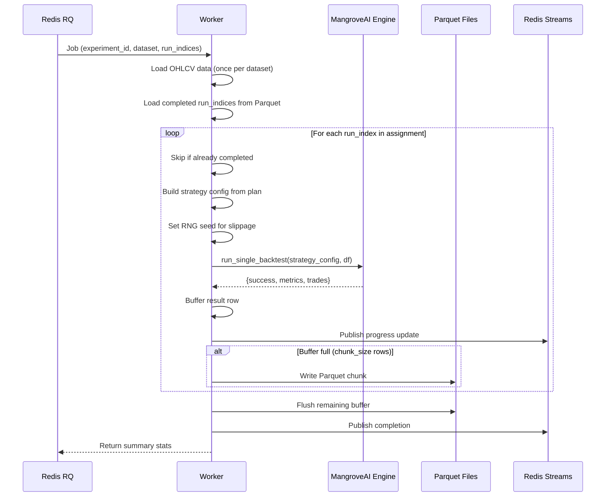

# Experiment Framework -- Specification Document

Date: 2026-02-28
Status: Draft
Author: Tim Darrah + Claude
Depends on: [Requirements Document](./2026-02-28-experiment-framework-requirements.md)

## 1. Data Model

### 1.1 Result Row Schema (Parquet)

One row per backtest run. No redundancy. Every column serves one purpose.
See `docs/data-model-exploration.md` for the complete strategy object and
how it maps to Parquet columns.

```mermaid
erDiagram
    RESULT_ROW {
        text experiment_id
        int run_index
        text code_version
        int rng_seed
        text data_file_path
        text data_file_hash
        int data_file_rows
        text strategy_name
        text asset
        text timeframe
        date start_date
        date end_date
        text entry_json
        text trigger_name
        int num_entry_signals
        text exit_json
        int num_exit_signals
        float reward_factor
        float max_risk_per_trade
        text stop_loss_calculation
        int atr_period
        float atr_volatility_factor
        float atr_short_weight
        float atr_long_weight
        float initial_balance
        float min_balance_threshold
        float min_trade_amount
        int max_open_positions
        int max_trades_per_day
        float max_units_per_trade
        float max_trade_amount
        int volatility_window
        float target_volatility
        text volatility_mode
        boolean enable_volatility_adj
        int max_hold_time_hours
        int cooldown_bars
        float daily_momentum_limit
        float weekly_momentum_limit
        int max_hold_bars
        int exit_on_loss_after_bars
        int exit_on_profit_after_bars
        float profit_threshold_pct
        float slippage_pct
        float fee_pct
        int total_trades
        float win_rate
        float total_return
        float sharpe_ratio
        float sortino_ratio
        float max_drawdown
        int max_drawdown_duration
        float calmar_ratio
        float gain_to_pain_ratio
        float irr_annualized
        float irr_daily
        float avg_daily_return
        int max_consecutive_wins
        int max_consecutive_losses
        int num_days
        float net_pnl
        float starting_balance_result
        float ending_balance
        text status
        text error_msg
        float elapsed_seconds
        text completed_at
    }
```



**Column groups:**

| Group | Columns | Purpose |
|-------|---------|---------|
| Identity | experiment_id, run_index | Locate this run within an experiment |
| Provenance | code_version, rng_seed, data_file_path, data_file_hash, data_file_rows | Reproduce exactly |
| Strategy identity | strategy_name, asset, timeframe, start_date, end_date | What was tested |
| Entry signals | entry_json, trigger_name, num_entry_signals | Variable-schema signal array (JSON) + extracted trigger for fast queries |
| Exit signals | exit_json, num_exit_signals | Variable-schema signal array (JSON) |
| Execution config | 28 flat columns | Fixed-schema, all natively queryable |
| Results | 18 metric columns | Fixed-schema, all natively queryable |
| Metadata | status, error_msg, elapsed_seconds, completed_at | Run outcome |

**Total: ~67 columns, ~700-1400 bytes/row uncompressed, ~100-250 bytes/row in Parquet.**

### 1.2 Strategy Config Reconstruction

Any row can be reconstructed into a complete strategy config:

```python
def reconstruct_strategy_config(row: dict) -> dict:
    """Rebuild the full strategy config from a Parquet result row."""
    return {
        "name": row["strategy_name"],
        "asset": row["asset"],
        "entry": json.loads(row["entry_json"]),
        "exit": json.loads(row["exit_json"]),
        "reward_factor": row["reward_factor"],
        "execution_config": {
            "max_risk_per_trade": row["max_risk_per_trade"],
            "stop_loss_calculation": row["stop_loss_calculation"],
            "atr_period": row["atr_period"],
            "atr_volatility_factor": row["atr_volatility_factor"],
            "atr_short_weight": row["atr_short_weight"],
            "atr_long_weight": row["atr_long_weight"],
            "initial_balance": row["initial_balance"],
            "min_balance_threshold": row["min_balance_threshold"],
            "min_trade_amount": row["min_trade_amount"],
            "max_open_positions": row["max_open_positions"],
            "max_trades_per_day": row["max_trades_per_day"],
            "max_units_per_trade": row["max_units_per_trade"],
            "max_trade_amount": row["max_trade_amount"],
            "volatility_window": row["volatility_window"],
            "target_volatility": row["target_volatility"],
            "volatility_mode": row["volatility_mode"],
            "enable_volatility_adjustment": row["enable_volatility_adj"],
            "max_hold_time_hours": row["max_hold_time_hours"],
            "cooldown_bars": row["cooldown_bars"],
            "daily_momentum_limit": row["daily_momentum_limit"],
            "weekly_momentum_limit": row["weekly_momentum_limit"],
            "max_hold_bars": row["max_hold_bars"],
            "exit_on_loss_after_bars": row["exit_on_loss_after_bars"],
            "exit_on_profit_after_bars": row["exit_on_profit_after_bars"],
            "profit_threshold_pct": row["profit_threshold_pct"],
            "slippage_pct": row["slippage_pct"],
            "fee_pct": row["fee_pct"],
        },
    }
```

### 1.3 Experiment Config

Stored as a Parquet metadata key-value pair in every chunk file AND as a
standalone JSON file in the experiment directory (for quick loading without
reading Parquet). This is not redundancy -- the Parquet metadata is the
provenance record, the JSON file is the access path.

```json
{
  "experiment_id": "exp_20260228_v2_full",
  "name": "V2 Full Exec Sweep",
  "description": "Sweep entry signals + execution config across all assets",
  "created_at": "2026-02-28T14:30:00Z",
  "code_version": "a1b2c3d",
  "seed": 42,
  "search_mode": "grid",
  "datasets": [
    {
      "asset": "BTC",
      "timeframe": "1d",
      "file": "btc_2022-08-01_2026-02-15_1d.csv",
      "hash": "sha256:e3b0c44298fc...",
      "rows": 1298,
      "start_date": "2022-08-01",
      "end_date": "2026-02-15"
    }
  ],
  "entry_signals": {
    "triggers": [
      {"name": "ema_cross_up", "params_sweep": {"window_fast": {"min": 5, "max": 30, "step": 5}, "window_slow": {"min": 20, "max": 100, "step": 10}}},
      {"name": "macd_bullish_cross", "params_sweep": {"window_fast": {"values": [8, 12, 16]}, "window_slow": {"values": [20, 26, 35]}, "window_sign": {"values": [5, 9, 12]}}}
    ],
    "filters": [
      {"name": "rsi_oversold", "params_sweep": {"window": {"min": 7, "max": 28, "step": 7}, "threshold": {"values": [25, 30, 35]}}},
      {"name": "adx_strong_trend", "params_sweep": {"window": {"values": [14]}, "threshold": {"min": 20, "max": 35, "step": 5}}}
    ],
    "min_filters": 1,
    "max_filters": 1,
    "constraints": [["window_fast", "<", "window_slow"]]
  },
  "exit_signals": {
    "triggers": [],
    "filters": [],
    "min_filters": 0,
    "max_filters": 0,
    "constraints": []
  },
  "execution_config": {
    "base": {
      "max_risk_per_trade": 0.01,
      "reward_factor": 2.0,
      "stop_loss_calculation": "dynamic_atr",
      "atr_period": 14,
      "...": "...all 28 fields with defaults..."
    },
    "sweep_axes": [
      {"param": "reward_factor", "type": "float", "values": [1.5, 2.0, 3.0, 5.0]},
      {"param": "cooldown_bars", "type": "int", "values": [0, 1, 3, 5]},
      {"param": "enable_volatility_adjustment", "type": "bool", "values": [true, false]}
    ]
  },
  "total_runs": 300000,
  "workers_per_dataset": 2,
  "status": "running"
}
```

### 1.4 Template

Same structure as experiment config, minus experiment_id, status, timestamps,
and computed fields (total_runs). Stored as JSON in `data/templates/`.

### 1.5 File Layout

```
MarketSimulator/data/
  experiments/
    exp_20260228_v2_full/
      config.json                      Experiment config (provenance)
      results/
        BTC_1d/                        Partitioned by asset_timeframe
          worker_00_chunk_000.parquet
          worker_00_chunk_001.parquet
          worker_01_chunk_000.parquet
        ETH_4h/
          worker_02_chunk_000.parquet
        DOGE_5m/
          worker_08_chunk_000.parquet
    exp_20260301_random_100k/
      config.json
      results/
        ...
  templates/
    full_exec_sweep.json
    quick_signal_test.json
```

DuckDB query patterns:
```sql
-- All results for one experiment
SELECT * FROM read_parquet('data/experiments/exp_20260228_v2_full/results/**/*.parquet')

-- One dataset only (partition pruning)
SELECT * FROM read_parquet('data/experiments/exp_20260228_v2_full/results/BTC_1d/*.parquet')

-- Cross-experiment query
SELECT * FROM read_parquet('data/experiments/exp_*/results/**/*.parquet')
WHERE experiment_id IN ('exp_20260228_v2_full', 'exp_20260301_random_100k')
```

---

## 2. API Specification

### 2.1 Experiments

#### POST /api/v1/experiments
Create a new experiment (draft status).

**Request body**: Experiment config JSON (section 1.3, minus computed fields).

**Response**: `201 Created` with experiment_id and status.

#### GET /api/v1/experiments
List all experiments.

**Query params**: `status` (filter), `sort` (created_at, name), `order` (asc/desc).

**Response**: Array of experiment summaries (id, name, status, total_runs,
completed_runs, created_at).

#### GET /api/v1/experiments/{id}
Get experiment detail including config and progress.

**Response**: Full experiment config + current progress stats.

#### PUT /api/v1/experiments/{id}
Update experiment config (draft status only).

#### DELETE /api/v1/experiments/{id}
Delete experiment and all result files (draft or completed only, not running).

### 2.2 Lifecycle

#### POST /api/v1/experiments/{id}/validate
Validate experiment config and compute run count.

**Response**: `{valid: bool, total_runs: int, errors: [str], warnings: [str]}`

Validation checks:
- At least one dataset selected
- At least one entry trigger + one entry filter
- All signal names exist in KB
- All param ranges within KB bounds
- Constraints are satisfiable
- Data files exist and are readable
- For grid search: compute exact run count
- For random search: confirm N is positive

#### POST /api/v1/experiments/{id}/launch
Launch experiment execution. Changes status to `running`.

**Response**: `{status: "running", run_id: str, workers: int}`

Side effects:
- Stores experiment config as provenance (config.json + Parquet metadata)
- Computes data file hashes
- Generates deterministic run plan
- Enqueues worker jobs to Redis RQ

#### POST /api/v1/experiments/{id}/pause
Pause running experiment. Workers finish current run then stop.

#### POST /api/v1/experiments/{id}/resume
Resume paused experiment. Queries completed run_index values, skips those.

### 2.3 Progress

#### GET /api/v1/experiments/{id}/progress
Server-Sent Events stream for real-time progress.

**SSE event format**:
```json
{
  "completed": 186000,
  "total": 300000,
  "rate": 0.85,
  "eta_seconds": 133200,
  "elapsed_seconds": 219600,
  "errors": 0,
  "no_trades": 41203,
  "per_dataset": {
    "BTC_1d": {"completed": 50000, "total": 50000, "status": "done"},
    "ETH_4h": {"completed": 36000, "total": 50000, "status": "running"},
    "DOGE_5m": {"completed": 27000, "total": 50000, "status": "running"}
  }
}
```

Implementation: FastAPI `StreamingResponse` yielding SSE events. Reads from
Redis Streams where workers publish progress updates.

```python
@router.get("/experiments/{experiment_id}/progress")
async def stream_progress(experiment_id: str):
    async def event_generator():
        last_id = "0"
        while True:
            entries = await redis.xread(
                {f"exp:{experiment_id}:progress": last_id},
                block=2000, count=10,
            )
            for stream, messages in entries:
                for msg_id, data in messages:
                    last_id = msg_id
                    yield f"data: {json.dumps(data)}\n\n"
    return StreamingResponse(
        event_generator(),
        media_type="text/event-stream",
    )
```

### 2.4 Results

#### GET /api/v1/experiments/{id}/results
Query experiment results with filters, sort, pagination.

**Query params**:
- `asset`: filter by asset symbol
- `timeframe`: filter by timeframe
- `trigger_name`: filter by trigger signal
- `status`: filter by run status (ok, no_trades, error)
- `min_trades`: minimum total_trades threshold
- `min_sharpe`: minimum sharpe_ratio threshold
- `min_win_rate`: minimum win_rate threshold
- Any exec config field name (e.g., `reward_factor=2.0`, `cooldown_bars=3`)
- `sort`: column name to sort by (default: sharpe_ratio)
- `order`: asc or desc (default: desc)
- `limit`: page size (default: 50, max: 500)
- `offset`: pagination offset (default: 0)

**Response**:
```json
{
  "total": 12847,
  "offset": 0,
  "limit": 50,
  "results": [
    {
      "run_index": 42917,
      "asset": "BTC",
      "timeframe": "1d",
      "trigger_name": "pvo_bullish_cross",
      "num_entry_signals": 2,
      "reward_factor": 3.0,
      "cooldown_bars": 1,
      "sharpe_ratio": 5.89,
      "total_return": 184.19,
      "max_drawdown": 0.51,
      "total_trades": 17,
      "win_rate": 0.82,
      "status": "ok"
    }
  ]
}
```

Implementation: DuckDB query over Parquet files with dynamic WHERE clause
built from query params.

```python
@router.get("/experiments/{experiment_id}/results")
async def query_results(
    experiment_id: str,
    asset: str = None,
    trigger_name: str = None,
    min_trades: int = 0,
    sort: str = "sharpe_ratio",
    order: str = "desc",
    limit: int = 50,
    offset: int = 0,
    # ... other filters
):
    path = f"data/experiments/{experiment_id}/results/**/*.parquet"
    where_clauses = ["status = 'ok'"]
    params = []

    if asset:
        where_clauses.append("asset = ?")
        params.append(asset)
    if trigger_name:
        where_clauses.append("trigger_name = ?")
        params.append(trigger_name)
    if min_trades > 0:
        where_clauses.append("total_trades >= ?")
        params.append(min_trades)

    where_sql = " AND ".join(where_clauses)
    sql = f"""
        SELECT * FROM read_parquet('{path}')
        WHERE {where_sql}
        ORDER BY {sort} {order}
        LIMIT {limit} OFFSET {offset}
    """

    conn = duckdb.connect()
    result = conn.execute(sql, params).fetchdf()
    return {"total": len(result), "offset": offset, "limit": limit, "results": result.to_dict("records")}
```

Note: The total count query runs separately for pagination metadata.

#### GET /api/v1/experiments/{id}/results/{run_index}/visualize
Re-run a specific backtest for visualization. Reconstructs the strategy
config from the result row, runs the backtest, caches trades in Redis.

**Response**: Metrics summary + trade array + signal data for chart overlay.

### 2.5 Datasets

#### GET /api/v1/datasets
List available OHLCV data files.

**Response**: Array of `{asset, timeframe, start_date, end_date, rows, file_path}`.

Scans MangroveAI's data directory for files matching the naming convention.

### 2.6 Signals

#### GET /api/v1/signals
List available signals from MangroveKnowledgeBase.

**Query params**: `type` (TRIGGER, FILTER), `search` (name substring).

**Response**: Array of signal metadata including name, type, params with
types/ranges/defaults, constraints.

### 2.7 Templates

#### GET /api/v1/templates
List saved templates.

#### POST /api/v1/templates
Save current experiment config as a named template.

#### GET /api/v1/templates/{name}
Load a template.

#### DELETE /api/v1/templates/{name}
Delete a template.

### 2.8 Exec Config Defaults

#### GET /api/v1/exec-config/defaults
Return the full default execution config from trading_defaults.json.

Used by the dashboard to populate the execution config section with
defaults before the user toggles sweep axes.

---

## 3. Run Plan Generation

### 3.1 Grid Search

Generate every valid combination of:
- Each selected dataset (asset x timeframe x date range)
- Each entry trigger x each entry filter (or multi-filter combo)
- Each param combo per signal (from grid builder: min/max/step or explicit values)
- Each exit signal combo + params (if any)
- Each execution config variant (from sweep axes)

Constraint filtering: after generating combinations, remove any that violate
constraints (e.g., window_fast >= window_slow).

Total runs = product of all dimension sizes (after constraint filtering).

### 3.2 Random Search

Sample N combinations uniformly from the same parameter space as grid search.
The seed ensures the same N combinations are generated every time.

Deduplication: hash each combination and skip duplicates.

### 3.3 Deterministic Plan

Given the same experiment config + seed:
1. Build the full parameter space
2. Generate combinations (grid or random)
3. Assign each combination a run_index (0-based, sequential)
4. Shuffle per-dataset using the seed for balanced worker distribution
5. Split across workers via round-robin

Same inputs = identical plan, byte-for-byte. This is critical for resume.

### 3.4 Resume

```python
# Query completed run_index values from existing Parquet files
completed = set(
    duckdb.sql(f"""
        SELECT run_index FROM read_parquet(
            'data/experiments/{experiment_id}/results/**/*.parquet'
        )
    """).fetchnumpy()["run_index"]
)

# Workers skip completed indices
for run in worker_plan:
    if run.run_index in completed:
        continue
    # execute backtest...
```

---

## 4. Worker Architecture

### 4.1 Worker Flow



### 4.2 Worker Independence

Workers share NO state. Each worker:
- Opens its own DuckDB connection for resume queries
- Loads its own copy of the OHLCV data
- Writes to its own Parquet files (no file contention)
- Publishes to Redis Streams independently

### 4.3 Parquet Writing

Each worker uses PyArrow's `pq.ParquetWriter` to write chunks:

```python
import pyarrow as pa
import pyarrow.parquet as pq

schema = pa.schema([
    ("experiment_id", pa.string()),
    ("run_index", pa.int32()),
    ("asset", pa.string()),
    ("trigger_name", pa.string()),
    ("entry_json", pa.string()),
    ("exit_json", pa.string()),
    ("reward_factor", pa.float32()),
    # ... all columns ...
    ("sharpe_ratio", pa.float64()),
    ("status", pa.string()),
])

writer = pq.ParquetWriter(chunk_path, schema)
# ... accumulate rows in a list ...
table = pa.table(row_buffer, schema=schema)
writer.write_table(table)
writer.close()
```

Chunk size: 1024 rows (configurable). Parquet metadata includes the
experiment config as a key-value pair for provenance.

---

## 5. Dashboard Specification

### 5.1 Configure View

Single scrollable page with collapsible sections. Each section has a header
bar (click to expand/collapse) with a chevron icon.

**Section order:**
1. Experiment Name & Description
2. Datasets (multi-select widget)
3. Entry Signals (signal selector + param grid builder per signal)
4. Exit Signals (same structure as entry)
5. Execution Config (default values + sweep toggles + param grid builder)
6. Search Mode & Budget (grid/random toggle, N input for random)
7. Provenance (code version, notes)
8. Actions (Validate, Launch, Save as Template)

**Dataset selector widget:**
- Table with columns: Asset, Timeframe, Start, End, Rows
- Checkbox per row for multi-select
- Search input (filters all columns)
- Column header click to sort
- Selected count badge

**Signal selector:**
- Two-panel layout: available signals (left), selected signals (right)
- Available panel: searchable, filterable by type (TRIGGER/FILTER)
- Each signal shows: type badge, name, param count
- Click to add to selected panel
- Selected panel: each signal expandable to show param grid builder
- Param grid builder per signal param (see FR-1.4 in requirements)

**Execution config section:**
- Table of all 28 fields with columns: Parameter, Type, Default, Sweep?
- Toggle switch in Sweep column
- When toggled on, param grid builder row expands below
- Non-swept params show their default value (editable)

**Validation panel:**
- Appears after clicking Validate
- Shows: total run count (auto-calculated for grid), warnings, errors
- Green/red status indicator
- Launch button enabled only after successful validation

### 5.2 Monitor View

- Experiment selector (dropdown of all non-draft experiments)
- Status badge (running, paused, completed, failed)
- Progress bar (overall + per-dataset)
- Rate, ETA, elapsed time
- Error/no-trade counters
- Pause/Cancel/Resume buttons
- Auto-refreshes via SSE connection

### 5.3 Explore View

- Experiment selector
- Filter bar (dropdowns and inputs for asset, trigger, status, exec config
  params, min trades, min Sharpe, etc.)
- Results table (paginated, sortable columns, click to select a row)
- Detail panel (appears when a row is selected):
  - Metrics summary (key numbers in a card layout)
  - Tab bar: Chart | Trades
  - Chart tab: OHLCV candlestick with trade markers + signal overlays
  - Trades tab: scrollable table of individual trades
- Cross-experiment comparison: select 2 experiments from dropdown, side-by-side
  metrics table or overlaid chart

---

## 6. Pydantic Models

### 6.1 Experiment Config

```python
class ParamSweep(BaseModel):
    """Sweep definition for a single parameter."""
    min: float | None = None
    max: float | None = None
    step: float | None = None
    values: list[float | int | str | bool] | None = None

class SignalConfig(BaseModel):
    """A signal selected for sweeping."""
    name: str
    params_sweep: dict[str, ParamSweep]

class SignalSelection(BaseModel):
    """Entry or exit signal configuration."""
    triggers: list[SignalConfig]
    filters: list[SignalConfig]
    min_filters: int = 1
    max_filters: int = 1
    constraints: list[list[str]] = []

class ExecConfigSweep(BaseModel):
    """Execution config with optional sweep axes."""
    base: dict[str, Any]
    sweep_axes: list[dict[str, Any]] = []

class DatasetSelection(BaseModel):
    """A selected data file."""
    asset: str
    timeframe: str
    file: str
    hash: str = ""
    rows: int = 0
    start_date: str
    end_date: str

class ExperimentConfig(BaseModel):
    """Full experiment configuration."""
    name: str
    description: str = ""
    seed: int = 42
    search_mode: Literal["grid", "random"] = "grid"
    n_random: int | None = None  # only for random search
    datasets: list[DatasetSelection]
    entry_signals: SignalSelection
    exit_signals: SignalSelection
    execution_config: ExecConfigSweep
    workers_per_dataset: int = 2
    code_version: str = ""
    notes: str = ""
```

### 6.2 Result Row

```python
class ResultRow(BaseModel):
    """A single backtest result for API responses."""
    run_index: int
    experiment_id: str
    asset: str
    timeframe: str
    trigger_name: str
    num_entry_signals: int
    num_exit_signals: int
    reward_factor: float
    max_risk_per_trade: float
    cooldown_bars: int
    atr_period: int
    atr_volatility_factor: float
    total_trades: int
    win_rate: float
    total_return: float
    sharpe_ratio: float
    sortino_ratio: float
    max_drawdown: float
    calmar_ratio: float
    net_pnl: float
    status: str
    # ... additional fields as needed
```

### 6.3 Progress Event

```python
class DatasetProgress(BaseModel):
    """Progress for a single dataset."""
    completed: int
    total: int
    status: Literal["pending", "running", "done", "failed"]

class ProgressEvent(BaseModel):
    """Real-time progress update."""
    completed: int
    total: int
    rate: float
    eta_seconds: float
    elapsed_seconds: float
    errors: int
    no_trades: int
    per_dataset: dict[str, DatasetProgress]
```

---

## 7. Redis Usage

### 7.1 Job Queue (RQ)

- Queue name: `experiments`
- Job payload: `{experiment_id, dataset_key, worker_id, run_indices}`
- One job per worker (not per run -- workers process batches)
- TTL: no timeout (long-running jobs)

### 7.2 Progress Streams

- Stream key: `exp:{experiment_id}:progress`
- Workers XADD after each completed run (or every N runs for efficiency)
- Dashboard reads via XREAD with blocking
- Stream trimmed after experiment completes (XTRIM MAXLEN 0)

### 7.3 Trade Cache

- Key pattern: `exp:{experiment_id}:trades:{run_index}`
- Value: JSON array of trade records
- TTL: 1 hour (ephemeral, re-computed on demand)
- Set when user clicks "Visualize" in the Explore view

---

## 8. Constraint System

### 8.1 Constraint Types

| Constraint | Syntax | Example |
|-----------|--------|---------|
| Less than | `[a, "<", b]` | `["window_fast", "<", "window_slow"]` |
| Greater than | `[a, ">", b]` | `["window_slow", ">", "window_fast"]` |
| Not equal | `[a, "!=", b]` | `["entry_tf", "!=", "exit_tf"]` |

### 8.2 Enforcement

Constraints are enforced at run plan generation time:
1. Generate all param combinations for a signal
2. For each combination, check all constraints
3. Filter out any combination that violates a constraint
4. If no valid combinations remain, report a validation error

Example: window_fast range [1, 50], window_slow range [25, 100],
constraint window_fast < window_slow. The overlapping region [25, 50]
produces valid pairs like (25, 26), (30, 50), etc. Invalid pairs like
(50, 25) are filtered.

Constraints come from signal metadata in the KB (already defined there for
signals like ema_cross_up, macd_bullish_cross, sma_cross_up).
